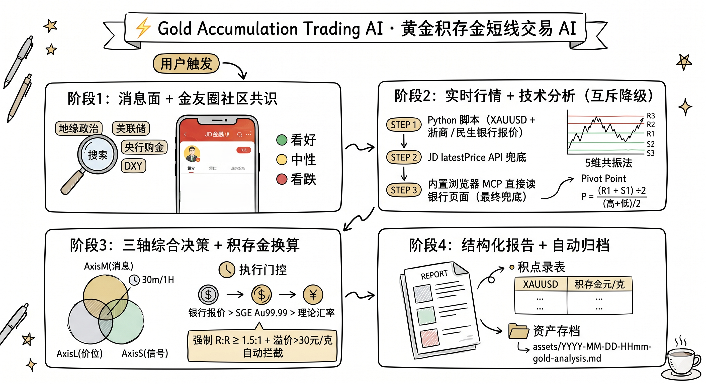

<div align="center">

# ⚡ Gold Accumulation Trading AI · 黄金积存金短线交易 AI

**一句话触发分析 · 聚合实时行情与情绪 · 精准换算国内积存金点位 · 辅助短线交易决策**

[](https://opensource.org/licenses/MIT)
[](https://www.investing.com/currencies/xau-usd)
[](https://github.com/PlevanTem/Trade-Accumulated-Gold-CN)

[快速开始](#-快速开始) · [工作原理](#-工作原理) · [配置指南](#-配置指南) · [示例报告](#-效果展示)

<br>

[](https://www.buymeacoffee.com/bufan666)  
**作者微信**: `lelouchdbf` · 交流 / 定制 / 合作

</div>

---

## 🤔 你是否有这些困惑？

- 银行 APP 里的积存金价格，**到底该在哪个点位买入？**
- 看了一堆财经政治新闻，**消息到底是利多还是利空？**
- XAUUSD 涨了 $50，**传导到国内积存金，点位怎么选？**
- 刷手机看到金价在波动，**现在能不能入场？**

**这个 AI Skill 专门解决这些问题。** 一句话触发，30秒内快速生成多源验证完整分析报告。

---

## ✨ 核心功能

| 功能 | 说明 |
|------|------|
| 🔴🟡🟢 **实时情绪判断** | 自动搜集最近1-4小时消息面，判定看好/看跌/中性，每条消息标注来源和影响 |
| 🧭 **三轴决策模型** | **AxisM**(消息) × **AxisL**(价位) × **AxisS**(信号) 综合给出方向；30m/1H 仅作「执行门控」过滤，避免被短线噪音带偏 |
| 🗣️ **金友圈社区共识** | 自动抓取京东金融 [@黄金小小彬] 个人页**最新一条**博主观点汇总，作为多博主共识参考；失败不阻塞主流程 |
| 📐 **精准点位计算** | 基于实时 OHLC 计算 R1/R2/R3 压力位、S1/S2/S3 支撑位、自定义轴心位 P |
| ⏱️ **多时间框架信号** | 直取 Investing.com 30min/1H/5H/日线/周线 5档信号，判断**当前能不能入场** |
| 💱 **积存金精准换算** | XAUUSD → 元/克，三级换算策略（银行实时报价 > SGE > 理论汇率），自动标注溢价并做溢出拦截 |
| 📊 **R:R 风险收益比** | 每笔交易强制计算止损/止盈，R:R ≥ 1.5:1 才推荐入场 |
| 🚨 **经济日历整合** | 自动读取当日已发布数据（ISM、非农、CPI 等），分析对金价的短期影响 |
| 📁 **报告自动归档** | 每次分析自动落盘 `assets/YYYY-MM-DD-HHmm-gold-analysis.md`，便于复盘回测 |

---

## 📸 效果展示

<details>

<summary>📄 点击展开报告分析示例</summary>

```
⚡ 黄金积存金实时短线分析
📅 2026-03-03 04:30 北京时间 | 数据时效: 实时（Investing.com 直取）

┌─────────────────────────────────────────┐
│  XAUUSD 现价  $5,336.34  (+1.11%)       │
│  Bid / Ask    $5,336.27 / $5,337.02     │
│  今日区间     $5,261.23 → $5,419.32     │
└─────────────────────────────────────────┘

⏱️ 多时间框架信号
  30分钟  🟢 买入      ← 短线动能转正！
  1小时   🟡 中性
  5小时   🟢 强烈买入
  日线    🟢 强烈买入
  周线    🟢 强烈买入

📐 关键点位（积存金换算）
  R2  $5,420  →  ~1,212 元/克  今日实际高点
  R1  $5,393  →  ~1,206 元/克  盘中阻力区
  ──────────────────────────────
  P   $5,340  →  ~1,194 元/克  轴心 (高+低)÷2
  ▶   $5,336  →  ~1,193 元/克  ← 当前价格
  ──────────────────────────────
  S1  $5,310  →  ~1,187 元/克  反弹起点支撑
  S2  $5,261  →  ~1,177 元/克  今日最低点

⚡ 能否入场？
  30min: 🟢 买入 → ✅ 可以准备入场（等轴心突破确认）

  方案A  轴心突破做多
  ├── 入场: $5,345-5,355  积存金 ≈ 1,196 元/克
  ├── 止损: $5,295        R:R = 1.5:1 ✅
  └── T1:   $5,419        积存金 ≈ 1,212 元/克
  
  方案B  回调低吸（更稳健）
  ├── 等待: 回调至 $5,305-5,315
  ├── 止损: $5,265        R:R = 2.2:1 ✅
  └── T1:   $5,393        积存金 ≈ 1,206 元/克
```

</details>


完整示例报告见 [assets/2026-04-19-1759-gold-analysis.md](assets/2026-04-19-1759-gold-analysis.md)。

报告结构对应 SKILL 阶段4 的强制落盘要求，包含：
- 顶部速览：**综合倾向（AxisM/L/S 三轴）** + **执行门控（30m/1H）** 两行核心结论
- 金友圈社区共识：3-8 条要点提炼 + 抓取时间戳 + content_id 溯源
- 完整点位表：XAUUSD 与浙商/民生积存金元/克双栏展示
- R:R 风险收益比验证 + 入场/止损/止盈三件套
- 数据来源：每条数据 Markdown 可点击 URL，抓取失败如实标注降级

---

## 🚀 快速开始

### 通用前置依赖

- **Python 3.9+**：用于运行 `scripts/` 下的实时行情/银行报价/金友圈抓取脚本
- **Playwright + Chromium**（可选，但强烈推荐）：京东金融银行积存金页面与金友圈帖子需要它

```bash
pip install playwright requests
playwright install chromium
```

> 没有 Playwright 也能跑：脚本会自动回退到 `latestPrice` API 兜底，并在报告中明确标注降级。

---

### 安装：四种 Agent 工具适配

仓库结构遵循 [Anthropic Skills 规范](https://docs.claude.com/en/docs/claude-code/skills)（`SKILL.md` + `references/` + `scripts/` + `assets/`），主流 Agent 工具均可直接识别。请按你使用的 Agent 选择对应安装方式。

<details>
<summary><b>方式 A：Cursor IDE</b></summary>

Cursor 把全局 skills 放在 `~/.cursor/skills/`；项目级则放在仓库内 `.cursor/skills/` 或 `.agents/skills/`。

```bash
# 全局安装（任何项目都能 @触发）
git clone https://github.com/PlevanTem/Trade-Accumulated-Gold-CN.git \
  ~/.cursor/skills/Trade-Accumulated-Gold-CN

# 或：项目内安装（仅当前项目可见）
git clone https://github.com/PlevanTem/Trade-Accumulated-Gold-CN.git \
  ./.agents/skills/Trade-Accumulated-Gold-CN
```

在 Cursor Chat 内 `@` 触发：

```
@Trade-Accumulated-Gold-CN/SKILL.md 当前积存金点位分析
@Trade-Accumulated-Gold-CN/SKILL.md 现在能买吗？
```

</details>

<details>
<summary><b>方式 B：Claude Code（Anthropic 官方 CLI）</b></summary>

Claude Code 的 skills 默认存放路径为 `~/.claude/skills/`。

```bash
# 全局安装
git clone https://github.com/PlevanTem/Trade-Accumulated-Gold-CN.git \
  ~/.claude/skills/Trade-Accumulated-Gold-CN
```

启动 `claude` 后会自动扫描该目录下的 `SKILL.md`，无需 `@` 也能在你提问「帮我分析积存金现在能不能买」时被自动选中调用。如需强制触发可显式说：

```
请使用 Trade-Accumulated-Gold-CN 这个 skill 帮我分析当前金价
```

</details>

<details>
<summary><b>方式 C：OpenClaw / ClawHub</b></summary>

OpenClaw 的 skills 路径与 Claude Code 类似，但前缀是 `~/.openclaw/`，并支持工作区级目录：

| 作用域 | 路径 |
|--------|------|
| 全局 skills | `~/.openclaw/skills/` |
| 工作区共享 | `~/.openclaw/workspace/skills/` |
| 当前 Agent 私有 | `~/.openclaw/workspace/agent/skills/` |

```bash
# 推荐安装到全局（所有 agent 共享）
git clone https://github.com/PlevanTem/Trade-Accumulated-Gold-CN.git \
  ~/.openclaw/skills/Trade-Accumulated-Gold-CN
```

ClawHub 启动后会在「Skills」面板看到本技能，点击或在对话中提及即可调用。

</details>

<details>
<summary><b>方式 D：Gemini CLI（Google 官方）</b></summary>

Gemini CLI 在 v0.x 起原生支持 Anthropic Skills 规范，目录约定为 `~/.gemini/skills/`（用户级）或 `./.gemini/skills/`（工作区级），并提供专门的 `gemini skills install` 命令。

```bash
# 方式 1：用官方命令（推荐）
gemini skills install https://github.com/PlevanTem/Trade-Accumulated-Gold-CN.git
# 工作区作用域：
gemini skills install https://github.com/PlevanTem/Trade-Accumulated-Gold-CN.git --scope workspace

# 方式 2：手动 git clone
git clone https://github.com/PlevanTem/Trade-Accumulated-Gold-CN.git \
  ~/.gemini/skills/Trade-Accumulated-Gold-CN
```

之后在 Gemini CLI 会话中正常提问，模型会根据 `SKILL.md` 头部 `description` 自动决定是否调用。

</details>

---

### 触发示例

无论哪种 agent，安装完成后都可以这样触发：

```
当前积存金点位分析
现在能不能买入积存金？
帮我分析黄金行情，重点看 30min/1H 信号
```

> AI 会自动执行 4 个阶段：消息面+金友圈共识 → 实时行情+技术分析 → 三轴决策+积存金换算 → 落盘报告，全程约 30-90 秒。

---

### 独立脚本：手动核验

不想跑完整工作流，只想看一下当前银行报价或博主观点？两个脚本都能独立执行：

```bash
# 浙商 / 民生积存金报价（Playwright 优先，失败自动 fallback 到 JD API）
python "./scripts/fetch_bank_quotes.py"

# 京东金融金友圈 [@黄金小小彬] 最新一条观点
python "./scripts/fetch_jd_personal_latest_post.py"
```

两者都输出**人类可读摘要 + 完整 JSON**，方便接入下游分析。

**没有 Playwright 又想读银行页面？** 在 Cursor 里可以让 Agent 走 `cursor-ide-browser` MCP（`browser_navigate` → `browser_lock` → `browser_snapshot` → `browser_unlock`）；其他 Agent 则会按 SKILL.md 阶段 2 的降级流程自动切换到搜索/SGE/理论换算兜底，并在报告中明确标注数据来源等级。

---

## 🔧 工作原理



```
用户触发
   │
   ▼
┌──────────────────────────────────────────────────────────┐
│  阶段1：消息面 + 金友圈社区共识                          │
│  ├── web_search: 地缘政治 / 美联储 / 央行购金 / DXY      │
│  ├── 京东金融个人页抓取 [@黄金小小彬] 最新观点           │
│  └── → 输出：🟢看好 / 🟡中性 / 🔴看跌 + 共识要点         │
└────────────────────┬─────────────────────────────────────┘
                     │
                     ▼
┌──────────────────────────────────────────────────────────┐
│  阶段2：实时行情 + 技术分析（互斥降级）                  │
│  ├── STEP1: Python 脚本（XAUUSD + 浙商/民生银行报价）   │
│  ├── STEP2: JD latestPrice API 兜底                     │
│  ├── STEP3: 内置浏览器 MCP 直接读银行页面（最终兜底）   │
│  ├── 计算 R1/R2/R3、S1/S2/S3（5维共振法）               │
│  └── 计算轴心 P = (R1 + S1) ÷ 2，盘中再算 (高+低)/2     │
└────────────────────┬─────────────────────────────────────┘
                     │
                     ▼
┌──────────────────────────────────────────────────────────┐
│  阶段3：三轴综合决策 + 积存金换算                        │
│  ├── AxisM(消息) × AxisL(价位) × AxisS(信号) → 偏多/空 │
│  ├── 30m/1H 作为「执行门控」过滤当下能否下单            │
│  ├── 三级换算：银行报价 > SGE Au99.99 > 理论汇率         │
│  └── 强制 R:R ≥ 1.5:1 + 溢价>30元/克 自动拦截           │
└────────────────────┬─────────────────────────────────────┘
                     │
                     ▼
┌──────────────────────────────────────────────────────────┐
│  阶段4：结构化报告 + 自动归档                            │
│  ├── 顶部两行：综合倾向(三轴) + 执行门控(30m/1H)        │
│  ├── 完整点位表：XAUUSD + 积存金元/克 双栏展示           │
│  ├── 数据来源：URL 链接 + 抓取时间，全程可追溯           │
│  └── 落盘 assets/YYYY-MM-DD-HHmm-gold-analysis.md       │
└──────────────────────────────────────────────────────────┘
```

---

## 💡 设计亮点

### 1. 实时优先，拒绝延时

传统分析工具往往使用小时前甚至天前的数据。本工具将 `WebFetch investing.com/currencies/xau-usd` 作为**第一步必须执行**的动作，单次请求同时获得：
- 实时 Bid/Ask 报价（精确到秒）
- 30min/1H/5H/日线/周线 全套技术信号
- 当日经济日历（已发布数据 vs 预期值）

### 2. 三轴决策 + 短线信号「门控化」

短线交易最容易犯的错误是：**只看 30min 指标定方向**。本工具把决策流程拆成两层：

- **方向层（三轴综合）**：`AxisM(消息+金友圈)` × `AxisL(现价 vs P/R1/S1)` × `AxisS(5H/日线 vs 30m/1H)`，三轴投票得出 **偏多/偏空/震荡**
- **执行层（短线门控）**：30min/1H 只回答「**当下时点是否适合下单**」，不回答方向

| 三轴综合 | 30m/1H 门控 | 行动 |
|----------|------------|------|
| 偏多 | 买入 | ✅ 可分批入场（须 R:R ≥ 1.5:1） |
| 偏多 | 卖出 | ⏳ **中期偏多但短线不追**，等回调至 S1/S2 + 门控转好 |
| 偏空 | 任意 | 🔻 逢高减仓为主，不抄底 |
| 震荡 | 任意 | 🔄 区间操作 / 观望 / 轻仓 |

> 这个设计专门解决 **「30min 红了就追多结果接在山顶」** 的常见亏损模式。

### 3. 积存金换算的 SGE 时间错位警告

上海黄金交易所 15:30 收盘，中国夜盘和美盘期间 SGE 数据已经"过期"。本工具会自动检测时间错位，若 XAUUSD 较 SGE 收盘后波动超过 $20，自动降级为理论换算并标注警告。

### 4. USD/CNY 大幅波动时的特殊处理

当美元指数 DXY 单日波动超过 0.5% 时（如美伊冲突导致美元和黄金同时上涨），工具会专门计算并说明：**国内积存金的实际涨幅可能显著不同于 XAUUSD 涨幅**。例如 2026-03-03：XAUUSD +1.11%，但 USD/CNY 同时涨 +1.37%，导致积存金实际涨幅达 **+2.48%**，远大于国际金价涨幅。

---

## 📁 文件结构

```
Trade-Accumulated-Gold-CN/
├── SKILL.md                                # AI Agent 核心指令（入口，遵循 Anthropic Skills 规范）
├── README.md                               # 本文档
├── .gitignore                              # 仅保留最新一份 assets 报告作为示例
├── assets/
│   └── 2026-04-19-1759-gold-analysis.md    # 示例输出报告（最新一份）
├── references/
│   ├── technical-analysis.md               # 技术分析指标详解（MA/BOLL/MACD/KDJ/RSI）
│   ├── accumulation-gold.md                # 积存金产品知识与换算规则详解
│   └── report-template.md                  # 标准报告输出模板（含金友圈结构化呈现格式）
└── scripts/
    ├── fetch_bank_quotes.py                # 浙商/民生银行积存金报价（Playwright + JD API 兜底）
    ├── fetch_jd_personal_latest_post.py    # 京东金融金友圈[黄金小小彬]最新观点抓取
    ├── live_market_data.py                 # XAUUSD 实时价 + USD/CNY 汇率
    └── ...                                 # 其余 test_*.py 为各数据源探活脚本
```

---

## 🛠️ 配置指南

### 自定义银行（默认：浙商 + 民生）

编辑 `SKILL.md` 中的 `搜索B` 部分，替换为你使用的银行积存金产品名称：

```
优先搜索: "工商银行积存金 建设银行积存金 今日金价"
```

### 调整交易节奏

`SKILL.md` 顶部的核心定位部分可调整：

```markdown
- **交易节奏**: 小时/天级别短线，快进快出    ← 改为"日/周级别"可切换到中线分析
- **收益目标**: 通过多次高胜率操作复利积累    ← 可根据自身目标调整
```

### 调整 R:R 门槛

默认 R:R ≥ 1.5:1，可在 `阶段3` 中修改：

```
R:R = (目标收益) ÷ (止损距离) ≥ 1.5:1    ← 改为 2:1 更保守
```

---

## 🤝 致谢 & Contributing

1. **京东金融金友圈博主** — 黄金小小斌（博主信息观点每日聚合，方便寻找共识）、兰宫花匠（积存金点位分析方法论）
2. **技术指标优化** — 在 `references/technical-analysis.md` 中补充
3. **实战案例** — 分享你用本工具做出的成功/失败交易案例
4. **Bug 反馈** — 如遇到换算错误或点位明显偏差，欢迎提 Issue

---

## ⚠️ 免责声明

本工具及相关分析报告**仅供学习和参考目的**，不构成任何投资建议。黄金市场波动剧烈，积存金交易存在亏损风险。请在充分了解相关风险的前提下，结合自身财务状况和风险承受能力自主决策。

**作者不对任何因使用本工具导致的投资损失承担责任。**

---

## 📄 License

MIT License — 自由使用、修改、分发，保留原始版权声明即可。

---

<div align="center">

**如果这个工具对你有帮助，请给一个 ⭐ Star！**

你的 Star 是持续更新和优化的最大动力 🙏


</div>
